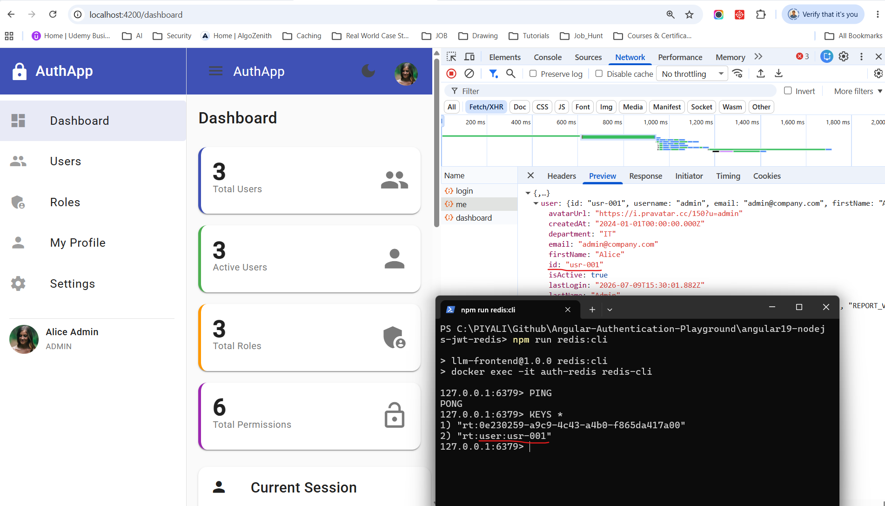
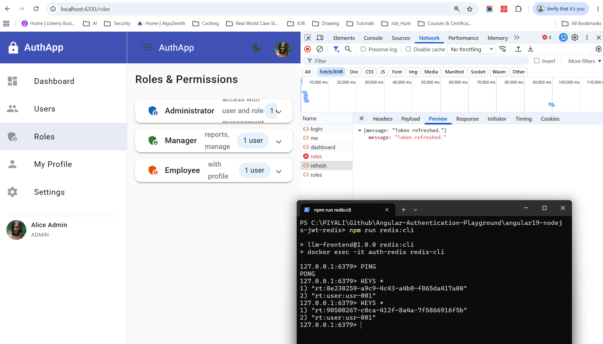

# Angular 19 + Node.js + Redis JWT Authentication & Authorization Application

> **Angular 19 + Node.js/Express** | HttpOnly Cookies | JWT | RBAC | Zero localStorage | i18n (`@angular/localize`) | Redis token store

---

## Table of Contents

1. [Architecture Overview](#architecture-overview)
2. [Authentication Flow](#authentication-flow)
3. [Token Refresh Flow](#token-refresh-flow)
4. [How Redis runs](#how-redis-runs)
5. [API Reference](#api-reference)
6. [Setup Guide](#setup-guide)
7. [Running the Application](#running-the-application)
8. [Demo Credentials](#demo-credentials)
9. [Security Best Practices](#security-best-practices)
10. [Helpful Redis commands](#helpful-redis-commands)
11. [Redis Data Types & Usability](#redis-data-types--usability)
12. [Internationalisation (i18n)](#internationalisation-i18n)
13. [Testing](#testing)
14. [Future Improvements](#future-improvements)

---

## Run Application
Full local dev flow from the repo root:

Open Docker desktop first

**Terminal 1**
```
npm run redis:start   # Starts a detached redis:7-alpine container named auth-redis on port 6379
npm run backend       # start Express
```

**Terminal 2**
```
npm start             # start Angular dev server
```

**Ternimal 3**
```
npm run redis:cli     # Opens an interactive redis-cli session inside the running container
```

## Redis Run
Log in from your Angular app. In Ternimal 3 :
Run:
```
PING
KEYS *
```
The exact key names depend on your implementation



**View the stored data**

Suppose the key is:
```
1) "rt:0e230259-a9c9-4c43-a4b0-f865da417a00"
2) "rt:user:usr-001"
```
Inspect the user mapping. Run:
```
TYPE rt:90500267-c0ca-412f-8a4a-7f5866916f5b
```
```
hash
```

If it's a string then GET instead of HGETALL rt:90500267-c0ca-412f-8a4a-7f5866916f5b.   
If it's a set then SMEMBERS rt:90500267-c0ca-412f-8a4a-7f5866916f5b 

Inspect the hash. Run:
```
HGETALL rt:90500267-c0ca-412f-8a4a-7f5866916f5b
```
```
1) "userId"
2) "usr-001"
3) "tokenHash"
4) "732a5d3fb3f00cc85a10995fc6602978c6e95511c1facbe3ce86cf3a25cb7a73"
5) "expiresAt"
```

| Field       | Purpose                                                      |
| ----------- | ------------------------------------------------------------ |
| `userId`    | The user who owns this refresh token (`usr-001`)             |
| `tokenHash` | **SHA-256 hash** of the refresh token (not the token itself) |
| `expiresAt` | When this refresh token becomes invalid                      |

**Why storing a hash is a best practice**

Notice you're not storing the actual refresh token in Redis.

Instead, you store:
```
Refresh Token
      │
      ▼
SHA-256
      │
      ▼
732a5d3fb3f00cc85a10995fc6602978c6e95511c1facbe3ce86cf3a25cb7a73
```
This is much safer because:
- If someone gains access to Redis, they cannot use the hash to authenticate.
- During a refresh request, your backend hashes the incoming refresh token and compares the hashes.
- This is similar to how passwords are stored as hashes instead of plaintext.

**Based on the key names, your application is likely implementing a refresh token store like this:**
```
                  LOGIN
                    │
                    ▼
          Validate username/password
                    │
                    ▼
     ┌────────────────────────────────┐
     │ Generate Access Token (JWT)    │
     │ Generate Refresh Token (JWT)   │
     └────────────────────────────────┘
                    │
        Hash refresh token (SHA-256)
                    │
                    ▼
              Store in Redis
     ┌───────────────────────────────┐
     │ Key: rt:<jti>                 │
     │ userId                        │
     │ tokenHash                     │
     │ expiresAt                     │
     └───────────────────────────────┘
                    │
                    ▼
 Return:
 • Access Token
 • HttpOnly Refresh Cookie
```
When the refresh endpoint is called:
1. Read the refresh token from the HttpOnly cookie.
2. Extract its jti (token ID).
3. Look up rt:<jti> in Redis.
4. Hash the received refresh token.
5. Compare it with the stored tokenHash.
6. If they match and the token hasn't expired, issue a new access token (and, if you're rotating refresh tokens, a new refresh token as well).

This design has several security advantages     
✅ Storing a hash instead of the raw refresh token : This is excellent. If Redis is compromised, attackers cannot directly use the stored value.  
✅ Each refresh token has a unique Redis key (rt:<jti>) : This allows individual token revocation and rotation.
✅ Expiration can be enforced with Redis TTL. Using Redis TTL : As long as you're setting an expiration on rt:<jti>, Redis will automatically clean up expired tokens. 
✅ Tokens can be revoked individually.  
✅ User-to-token mappings (rt:user:usr-001) or Associating tokens with a user (rt:user:usr-001) : This enables logout from one device and logout from all devices. 

## How Redis runs
**You currently have two separate servers:**
```
┌───────────────────────────┐
│ Angular Frontend          │
│ http://localhost:4200     │
└──────────────┬────────────┘
               │ HTTP
               ▼
┌───────────────────────────┐
│ Node.js/Express Backend   │
│ http://localhost:3000     │
└──────────────┬────────────┘
               │ Redis Client
               ▼
┌───────────────────────────┐
│ Redis Server              │
│ redis://localhost:6379    │
└───────────────────────────┘
```
- Angular → UI
- Node.js Express → Authentication API
- Redis → In-memory database used for sessions, refresh tokens, caching, etc.

After a successful login, a common flow is:
```
User logs in
       │
       ▼
Node.js validates credentials
       │
       ├── Generates Access Token (JWT)
       ├── Generates Refresh Token
       └── Stores session in Redis
                     │
                     ▼
Redis
┌──────────────────────────────┐
│ session:abc123               │
│ userId: 1                    │
│ refreshTokenId: xyz789       │
│ expires: 7 days              │
└──────────────────────────────┘
```
When the user later refreshes their session, the backend checks Redis to verify the session is still valid before issuing a new access token.

---

## Architecture Overview

```
┌─────────────────────────────────────────────────────────────────┐
│                     Angular 19 Frontend                         │
│                                                                 │
│  LoginComponent  ──▶  AuthService ──▶  tokenInterceptor        │
│  DashboardComponent    (Signals)        (HttpInterceptorFn)     │
│  UsersComponent        currentUser      withCredentials: true   │
│  RolesComponent        isAuthenticated  401 → refresh → retry  │
│  ProfileComponent      userPermissions  403 → snackbar         │
│  SettingsComponent                      500 → error dialog     │
│                                                                 │
│  Guards: authGuard | roleGuard                                  │
│  Directive: *hasPermission                                      │
└──────────────────────┬──────────────────────────────────────────┘
                       │  HTTP (withCredentials: true)
                       │  Cookies sent automatically by browser
                       │
┌──────────────────────▼──────────────────────────────────────────┐
│                  Node.js / Express Backend                       │
│                                                                 │
│  auth.routes  →  authController  →  authService                │
│  users.routes →  usersController →  userRepository             │
│  roles.routes →  MOCK_ROLES                                     │
│                                                                 │
│  Middlewares:                                                   │
│    helmet    — secure headers                                   │
│    cors      — CORS with credentials                           │
│    rateLimit — brute-force protection                           │
│    authenticate — JWT cookie validation                         │
│    requirePermission — RBAC                                     │
│                                                                 │
│  Token Store:                                                   │
│    Redis (ioredis) — refresh tokens hashed with SHA-256        │
│    rt:{jti} HASH + rt:user:{userId} SET  — auto-TTL eviction   │
└─────────────────────────────────────────────────────────────────┘
```

---

## Authentication Flow

```
 Angular Client                              Express Backend
     │                                             │
     │  POST /api/auth/login                       │
     │  { username, password }                     │
     │─────────────────────────────────────────── ▶│
     │                                             │
     │                              bcrypt.compare()
     │                              signAccessToken()   (15 min)
     │                              signRefreshToken()  (7 days)
     │                              store refreshToken hash in Map
     │                                             │
     │◀─────────────────────────────────────────── │
     │  Set-Cookie: accessToken  (HttpOnly, 15 min) │
     │  Set-Cookie: refreshToken (HttpOnly, Strict, 7d, path=/api/auth/refresh)
     │  Body: { user: {...} }                      │
     │                                             │
     │  ✅ JS cannot read these cookies            │
     │  ✅ Body only carries user profile          │
     │                                             │
3.   │  GET /api/dashboard                         │
     │  (browser sends cookies automatically)       │
     │─────────────────────────────────────────── ▶│
     │                              authenticate middleware
     │                              verifyAccessToken(cookie)
     │◀─────────────────────────────────────────── │
     │  200 { stats, recentActivity, ... }         │
```

---

## Token Refresh Flow

```
 Angular Client                         Express Backend
     │                                       │
     │  GET /api/users                       │
     │─────────────────────────────────────▶ │
     │                        JWT expired → 401
     │◀──────────────────────────────────── │
     │                                       │
     │  [tokenInterceptor catches 401]        │
     │                                       │
     │  POST /api/auth/refresh               │
     │  (browser sends refreshToken cookie) ▶│
     │                        verifyRefreshToken()
     │                        findValid() — check hash + revocation
     │                        revoke old token (rotation)
     │                        issue new access + refresh tokens
     │◀──────────────────────────────────── │
     │  Set-Cookie: accessToken (new)        │
     │  Set-Cookie: refreshToken (new)       │
     │                                       │
     │  Retry GET /api/users                 │
     │─────────────────────────────────────▶ │
     │◀──────────────────────────────────── │
     │  200 { data: [...] }                  │
```

---

## API Reference

| Method | Endpoint                | Auth | Permission  | Description                        |
|--------|-------------------------|------|-------------|------------------------------------|
| POST   | `/api/auth/login`       | —    | —           | Validate credentials, set cookies  |
| POST   | `/api/auth/refresh`     | —    | —           | Rotate refresh token, new cookie   |
| POST   | `/api/auth/logout`      | ✅   | —           | Revoke tokens, clear cookies       |
| GET    | `/api/auth/me`          | ✅   | —           | Return current user profile        |
| GET    | `/api/users`            | ✅   | USER_READ   | Paginated, searchable user list    |
| GET    | `/api/users/:id`        | ✅   | USER_READ   | Single user detail                 |
| POST   | `/api/users`            | ✅   | USER_WRITE  | Create new user                    |
| PUT    | `/api/users/:id`        | ✅   | USER_WRITE  | Update user                        |
| DELETE | `/api/users/:id`        | ✅   | USER_DELETE | Remove user                        |
| GET    | `/api/roles`            | ✅   | —           | List roles with permissions        |
| GET    | `/api/permissions`      | ✅   | —           | List all permissions               |
| GET    | `/api/dashboard`        | ✅   | —           | Stats, activity, API health        |

---

## Setup Guide

### Prerequisites

- Node.js ≥ 18
- npm ≥ 9

### Backend

```bash
cd backend
npm install
cp .env.example .env
# Edit .env — set strong JWT secrets and REDIS_URL
npm run dev          # starts on http://localhost:3000
```

> **Redis required.** The backend exits on startup if Redis is unreachable.
> For local development: `docker run -d -p 6379:6379 redis:7-alpine`
> Set `REDIS_URL=redis://localhost:6379` in `.env` (this is the default).

### Frontend

```bash
# From project root
npm install
npm start            # starts on http://localhost:4200
                     # proxies /api → http://localhost:3000
```
---

## Demo Credentials

| Username   | Password       | Role     | Accessible Pages                   |
|------------|----------------|----------|------------------------------------|
| `admin`    | `Admin@123`    | ADMIN    | All pages including Users & Roles  |
| `manager`  | `Manager@123`  | MANAGER  | Dashboard, Profile, Settings       |
| `employee` | `Employee@123` | EMPLOYEE | Dashboard, Profile, Settings       |

---


## Security Best Practices

### Token Storage
- ✅ Access token stored in **HttpOnly Secure SameSite cookie** — JS cannot read it
- ✅ Refresh token stored in **HttpOnly Secure SameSite=Strict cookie** scoped to `/api/auth/refresh`
- ❌ Never uses localStorage, sessionStorage, IndexedDB, or window.name

### Token Rotation
- Each refresh call **revokes the old refresh token** and issues a new pair
- Refresh token reuse (stolen token replay) triggers **revocation of ALL user tokens**

### Password Security
- Passwords hashed with **bcrypt (cost 10)** — never stored plaintext
- Hash is **never included** in any API response (`passwordHash` stripped by `toPublicUser`)

### Network Security
- **Helmet** — sets 11 security headers (CSP, HSTS, X-Frame-Options, etc.)
- **CORS** — allowlist only `FRONTEND_URL`, requires credentials
- **Rate limiting** — 20 auth requests / 15 min, 300 general requests / 15 min

### Input Validation
- All inputs validated with **express-validator** before reaching controllers
- Requests over 10 KB rejected

---

## Helpful Redis commands
| Command         | Purpose                              |
| --------------- | ------------------------------------ |
| `PING`          | Check Redis is running               |
| `KEYS *`        | Show all keys (fine for development) |
| `SCAN 0`        | Safely iterate through keys          |
| `GET <key>`     | Read a string value                  |
| `HGETALL <key>` | Read a hash                          |
| `TTL <key>`     | Show remaining lifetime              |
| `DEL <key>`     | Delete a key                         |
| `FLUSHALL`      | Remove all data (development only)   |


## Redis Data Types & Usability
| Redis Data Type       | Stores                   | Time Complexity | Common Use Cases                      | Example                                         |
| --------------------- | ------------------------ | --------------- | ------------------------------------- | ----------------------------------------------- |
| **String**            | Single value             | O(1)            | JWT blacklist, OTP, Cache, Session ID | `SET otp:usr-001 123456`                        |
| **Hash** ⭐            | Key-Value fields         | O(1)            | User profile, Refresh Token metadata  | `HSET rt:<jti> userId usr-001 tokenHash abc...` |
| **List**              | Ordered collection       | O(1) head/tail  | Activity logs, Notifications          | `LPUSH login-history usr-001`                   |
| **Set**               | Unique values            | O(1)            | User Roles, Active Devices            | `SADD user:usr-001:roles ADMIN USER`            |
| **Sorted Set (ZSET)** | Ordered by score         | O(log N)        | Leaderboards, Expiring Sessions       | `ZADD sessions 1752050000 usr-001`              |
| **Stream**            | Append-only event log    | O(1)            | Audit logs, Event-driven architecture | `XADD auth-events * action login`               |
| **Bitmap**            | Bit array                | O(1)            | Feature flags, Daily login tracking   | `SETBIT login:2026-07-11 123 1`                 |
| **HyperLogLog**       | Approximate unique count | O(1)            | Unique visitors                       | `PFADD visitors user1 user2`                    |
| **Geospatial**        | Latitude & Longitude     | O(log N)        | Nearby users, Delivery apps           | `GEOADD users 77.59 12.97 usr-001`              |


---

## Internationalisation (i18n)

This project uses Angular's built-in `@angular/localize` package for compile-time i18n — no runtime overhead, no extra bundle for the default locale.

### How it works

| Layer | Mechanism |
|---|---|
| HTML templates | `i18n` attribute on every user-visible element |
| TypeScript strings | `$localize` tagged template literal |
| Attributes (`alt`, `placeholder`, `matTooltip`) | `i18n-<attr>` attribute |
| Plural forms | ICU `{n, plural, =1 {...} other {...}}` expressions |

Every message has a stable **custom ID** (`@@id`) so translations are never broken by whitespace tweaks.

### Locale files

```
src/locale/
├── messages.xlf       # Source (en-US) — commit this, keep it in sync
└── messages.fr.xlf    # French translation
```

### Extract source strings

```bash
npm run i18n:extract
# writes/updates src/locale/messages.xlf
```

### Build & serve for a specific locale

```bash
# Development server — French
ng serve --configuration=fr

# Production build — all configured locales (outputs dist/llm-frontend/en-US/ and dist/llm-frontend/fr/)
npm run build:fr
# or: ng build --localize
```

### Add a new locale (e.g. German)

1. Copy `src/locale/messages.fr.xlf` → `src/locale/messages.de.xlf`
2. Set `target-language="de"` and translate every `<target>` element
3. Register it in `angular.json` under `projects.llm-frontend.i18n.locales`:
   ```json
   "de": { "translation": "src/locale/messages.de.xlf", "baseHref": "/de/" }
   ```
4. Add a `de` build/serve configuration (mirror the `fr` block)
5. Run `ng serve --configuration=de`

---

## Testing

### Backend (Jest + Supertest)
```bash
cd backend && npm test
```
Covers: login success/failure, HttpOnly cookie assertion, refresh rotation, logout cookie clearing, RBAC enforcement.

### Frontend (Jasmine/Karma)
```bash
npm test
```
Covers: AuthService signal state, login/logout flows, authGuard/roleGuard redirect logic, tokenInterceptor withCredentials + 401 retry.

---

## Future Improvements

| Area | Improvement |
|------|-------------|
| Auth | Add TOTP-based MFA (authenticator app) |
| Auth | OAuth2 / OIDC social login (Google, Microsoft) |
| Security | CSRF double-submit cookie pattern |
| Security | Content-Security-Policy nonce for inline scripts |
| Sessions | Real session management with `express-session` |
| Monitoring | Structured logging with Winston / Pino |
| Observability | OpenTelemetry tracing |
| Frontend | PWA support with offline capability |
| Testing | E2E tests with Playwright |
| CI/CD | GitHub Actions pipeline with Docker build |
